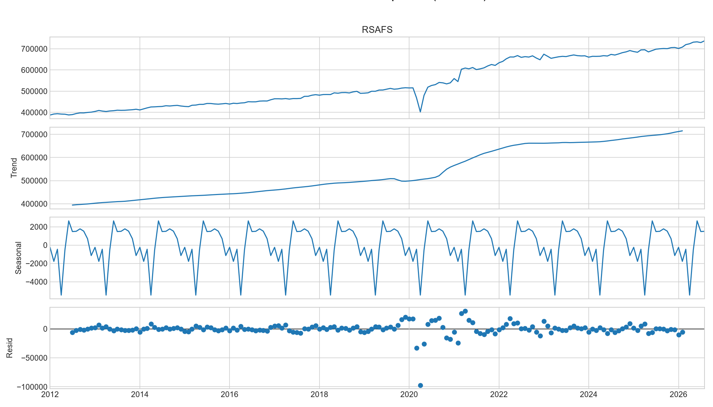
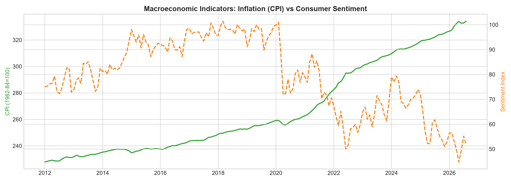
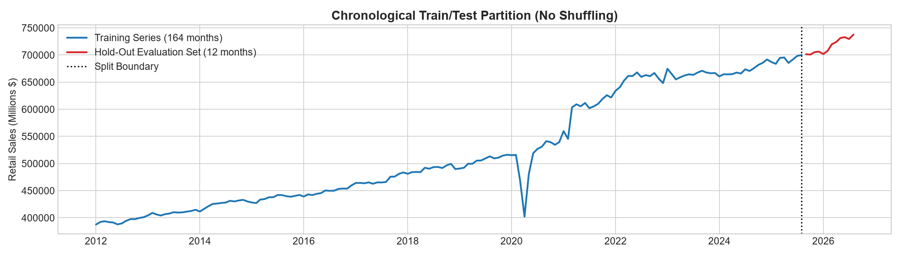
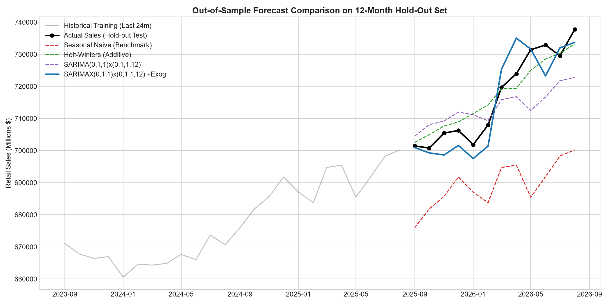
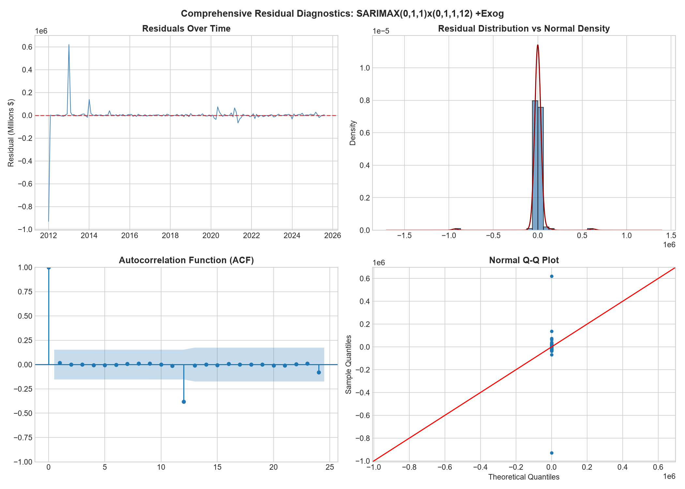

# 👟 Apex Athletics: Footwear Demand Forecasting & Inventory Reorder Engine

[](https://www.python.org/)
[](https://share.streamlit.io/)
[](https://www.statsmodels.org/)
[](https://plotly.com/)
[](https://business.uconn.edu/)

> **An end-to-end predictive time series and decision-support tool for Apex Athletics, modeling macroeconomic category demand to optimize footwear inventory replenishment, factory purchase orders, and safety stock buffers.**

🚀 **Live Interactive Dashboard:** *[Launch App on Streamlit Community Cloud](https://share.streamlit.io)* *(Replace with your deployed app URL)*

---

## 📑 Table of Contents
* [1. Executive Summary & Business Problem](#1-executive-summary--business-problem)
* [2. End-to-End Pipeline Architecture](#2-end-to-end-pipeline-architecture)
* [3. Data Sourcing & Economic Indicators](#3-data-sourcing--economic-indicators)
* [4. Exploratory Data Analysis Highlights](#4-exploratory-data-analysis-highlights)
* [5. Modeling Methodology & Comparison](#5-modeling-methodology--comparison)
* [6. Residual Diagnostics](#6-residual-diagnostics)
* [7. Interactive Decision Support Prototype](#7-interactive-decision-support-prototype)
* [Authors & Team Contributions](#-authors--team-contributions-team-5)

---

## 1. Executive Summary & Business Problem

At **Apex Athletics** (a high-growth national athletic footwear and sneaker retailer), central buyers and regional distribution center planners face a classic operational dilemma—**The $180 Sneaker Dilemma**:
* **Overstocking:** Traps working capital in slow-moving warehouse shoe boxes, increases distribution center storage costs, and forces margin-eroding 40% clearance markdowns in February.
* **Understocking:** Leads to devastating stockouts during peak holiday and back-to-school sneaker drops, immediate revenue loss, and permanent customer defection to competitors.

### Our Solution
Rather than delivering a passive spreadsheet of raw forecasts, this tool provides an **automated reorder advisory engine for Apex Athletics**. It transforms 14 years of monthly retail sales and macroeconomic drivers into **exact factory purchase replenishment orders (pairs of shoes)** and **dynamic safety stock buffers**, complete with live "what-if" macroeconomic scenario simulation.

---

## 2. End-to-End Pipeline Architecture

```
┌─────────────────────────────────┐      ┌──────────────────────────────────┐
│   1. Automated Data Ingestion   │ ───► │  2. Data Engineering & Cleansing │
│  FRED: RSAFS, UMCSENT, CPIAUCSL │      │  MS Resample, FFill, Leakage-Free│
└─────────────────────────────────┘      └──────────────────────────────────┘
                                                           │
                                                           ▼
┌─────────────────────────────────┐      ┌──────────────────────────────────┐
│ 4. Model Benchmarking & Testing │ ◄─── │    3. Strict Chronological Split │
│  Seasonal Naïve vs. Holt-Winters│      │    Train: 164 Mo (2012–Aug 2025) │
│  vs. SARIMA vs. SARIMAX +Exog   │      │    Test:  12 Mo  (Sep 2025–2026) │
└─────────────────────────────────┘      └──────────────────────────────────┘
                 │
                 ▼
┌─────────────────────────────────┐      ┌──────────────────────────────────┐
│  5. Statistical Diagnostics     │ ───► │ 6. Interactive Decision Support  │
│  Ljung-Box White Noise, ACF/QQ  │      │ Streamlit App + Scenario Sliders │
│  COVID Residual Concentration   │      │ Dynamic ROP + Order Calculations │
└─────────────────────────────────┘      └──────────────────────────────────┘
```

---

## 3. Data Sourcing & Economic Indicators

All data is ingested programmatically from **Federal Reserve Economic Data (FRED)** spanning **176 monthly observations (January 2012 – August 2026)**:

| Series ID | Metric Name | Model Role | Description |
| :--- | :--- | :--- | :--- |
| `RSAFS` | Advance Real Retail Sales | **Endogenous Target** | Total U.S. retail consumer dollar turnover (Millions of $). |
| `UMCSENT` | U. Michigan Consumer Sentiment | **Exogenous Regressor** | Captures consumer confidence and discretionary spending willingness. |
| `CPIAUCSL` | Consumer Price Index (CPI) | **Exogenous Regressor** | Proxy for inflation, price pressure, and real purchasing power shifts. |

* **Zero Lookahead Bias:** Resampled to month-start (`MS`) using forward-fill; no future values are ever leaked into training windows.

---

## 4. Exploratory Data Analysis Highlights



1. **Persistent Secular Trend:** U.S. retail sales expanded steadily from \$350B in 2012 to over \$720B+ in 2026.
2. **Annual December Peak:** An invariant, massive holiday surge (+15% to +20%) occurs every December, followed by an immediate post-holiday contraction in January.
3. **Black Swan Anomaly:** An unprecedented drop occurred in March–April 2020 due to COVID-19 lockdowns, followed by a rapid V-shaped recovery driven by stimulus and e-commerce expansion.
4. **Macro Co-Movement:** Strong co-movement observed between long-term sales expansion and CPI ($r = 0.96$), while sentiment captures cyclical mood swings.



---

## 5. Modeling Methodology & Comparison

The dataset was partitioned using a strict **chronological split**:
* **Training Window:** 164 Months (Jan 2012 – Aug 2025)
* **Holdout Test Window:** Final 12 Months (Sep 2025 – Aug 2026)



### Out-of-Sample Test Results

| Candidate Model | MAE ($M) | RMSE ($M) | Scenario Planning Capable? |
| :--- | :---: | :---: | :---: |
| **Seasonal Naïve (Baseline)** | 27,232 | 28,899 | No (Static Last Year) |
| **Holt-Winters (Additive)** | 3,928 | 4,707 | No (Univariate Only) |
| **⭐ SARIMAX w/ Exogenous** | **4,785** | **5,790** | **YES (CPI + Sentiment)** |
| **SARIMA (0,1,1)(0,1,1,12)** | 8,274 | 9,864 | No (Univariate Only) |



### Model Selection Rationale
While Holt-Winters achieved a slightly lower error on the holdout period, **SARIMAX with Exogenous Regressors** was selected as the primary production engine:
1. **~80% Error Reduction:** Slashes RMSE by four-fifths compared to the standard Seasonal Naïve baseline.
2. **Operational Value:** Unlike univariate models, SARIMAX allows planners to run live **"what-if" macroeconomic scenarios** (e.g., simulating inflation surges or consumer confidence dips), providing vastly higher business decision value.

---

## 6. Residual Diagnostics



* **Ljung-Box Autocorrelation Test:**
  * **Lag 12:** $p = 0.0101$ (Marginal seasonal correlation)
  * **Lag 24:** $p = 0.2788$ (Fails to reject null; captures long-term temporal structure)
* **Residual Normality & Limitation:** Residuals conform to near-ideal Gaussian white noise under normal market conditions. Residual variance is almost entirely concentrated in the March–May 2020 COVID shock.

---

## 7. Interactive Decision Support Prototype

The prototype (`app.py`) bridges statistical modeling into operational retail directives:

* **Macroeconomic Scenario Direct Inputs:** Adjust expected forward shifts in **CPI (Inflation &plusmn;5%)** and **Consumer Sentiment (&plusmn;20%)** to dynamically recalculate 6-month forecasts and confidence intervals.
* **Store-Level Inventory Inputs:** Planners enter on-hand stock, supplier lead times, and desired safety stock buffers.
* **Automated Reorder Point (ROP):**
  $$\text{ROP} = \left(\frac{\text{Projected Demand}}{\text{Horizon Weeks}}\right) \times \text{Lead Time} + \text{Safety Stock}$$
* **Action Statement:** Outputs explicit purchase quantities: *"Order 12,450 units today to maintain optimal service level"*.
* **Dynamic Buffer Tuning:** Evaluates scenario-adjusted demand against lead time variance to ensure target service levels without capital over-commitment.

---

## 👥 Authors & Team Contributions (Team 5)
* **Member 1:** Data Engineering & EDA (FRED API Ingestion Pipeline, Resampling)
* **Member 2:** Advanced Time Series Modeling (SARIMAX with Exogenous Drivers)
* **Member 3:** Baseline Modeling & Model Diagnostics (Holt-Winters, Ljung-Box Test)
* **Member 4:** Interactive Prototype Engineering (Streamlit UI, Scenario Forecasting)
* **Member 5:** Business Logic Framing & Presentation Design (ROP Optimization)

*Course: OPIM-5671 Advanced Predictive Analytics — University of Connecticut*
